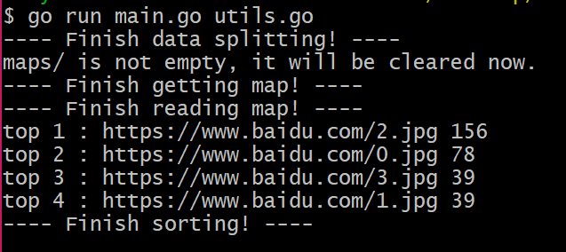

# URLCount
Calculate the number of URLs in the top 100 and the number of occurrences within 1GB of memory.


### Dataset preparation

In this project, a python script `createURL.py` is used to generate the `URL.txt`, which contains a random number of different URLs. Using `createURL.py` , you can generate a URL record of about 20GB. In `URL.txt`, each URL occupies one line.


### Requirements

1. Requirements for `Python 3` and `go 1.12.1`

2. OS: Linux


### Installation 

1. Clone the `URLCount` repository.

```shell
git clone https://github.com/AkinoRito/URLCount.git
cd URLCount
```

2. Use `createURL.py` to generate dataset.

```shell
python createURL.py
```

​	Generating URLs may take some time.

3. Execute Golang scripts

```shell
go run main.go utils.go
```

4. Execute the test script

```shell
go test -v
```


### Run Result (demo)

